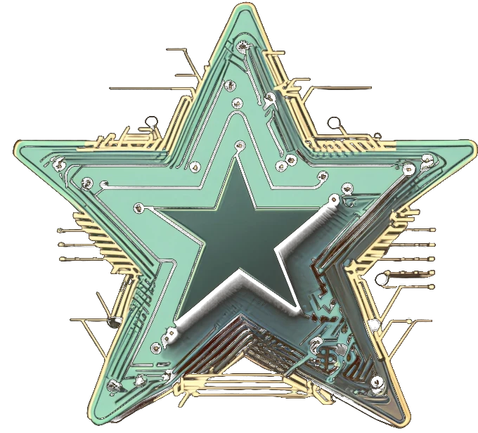

# Portal da Maristela

Portfólio pessoal da professora Maristela (Stela) e porta de entrada para os sites das disciplinas e dos preparatórios de certificação, publicado no GitHub Pages.

É o primeiro de vários sites com o mesmo visual: o jeito do github.com e da Apple/macOS, com a placa de circuito da Stela. Cada site é um repositório próprio.

## Sobre o projeto

- **Autora:** Maristela (Stela), professora de TI na Faculdade de Tecnologia e Inovação Senac DF.
- **Objetivo:** apresentar quem ela é (história, formação, skills, palestras, arte com sucata eletrônica) e linkar os sites de todas as disciplinas e preparatórios de certificação.
- **Público:** alunos (que ela chama de "filhotes"), colegas, coordenação, organizadores de eventos e interessados nos preparatórios.
- **Idioma:** português do Brasil em todo o conteúdo, código comentado em português.

## Arquivos

```
index.html            o portal (só o estilo e o script exclusivos dele ficam aqui)
404.html              "Trilha rompida": aparece em qualquer endereço inexistente do domínio
assets/
  css/estilo.css      visual comum a todos os sites (cores dos dois temas, fontes, barra, janelas, cards…)
  js/placa.js         tema, A+, pausa, menu do celular, aparecer ao rolar; comum a todos os sites
  img/                imagens em WebP (estrela.webp, coracao.webp, palestra.webp)
  img/tec/            logos das tecnologias em SVG (Devicon, licença MIT; Cisco, XAMPP e Espressif do Simple Icons, CC0)
README.md             este arquivo
CLAUDE.md             instruções para o Claude Code (fica só no computador, não vai para o GitHub)
.gitignore            o que o git ignora: .DS_Store, CLAUDE.md, .claude/
.nojekyll             vazio; impede o GitHub de transformar .md em página do site
```

## Estrutura no GitHub Pages

Este repositório é o site principal: `MARISTELAOLIVEIRA/MARISTELAOLIVEIRA.github.io`, publicado em **https://maristelaoliveira.github.io**. Cada disciplina fica em um repositório próprio da mesma conta e vira uma subpasta do mesmo endereço:

| Site | Repositório | Endereço |
|---|---|---|
| Portal (este) | `MARISTELAOLIVEIRA.github.io` | `/` |
| Programação Web em JavaScript | `prog-web-js` | `/prog-web-js/` |
| Linguagem de Programação para Web II – PHP | `prog-web-php` | `/prog-web-php/` |
| Laboratório de Inovação IV | `lab-inovacao-4` | `/lab-inovacao-4/` |
| Laboratórios de Inovação II e III | `lab-inovacao-2-3` | `/lab-inovacao-2-3/` |
| Lógica de Programação com Python | `logica-python` | `/logica-python/` |
| Segurança em Nuvem | `seguranca-nuvem` | `/seguranca-nuvem/` |
| Administração de Recursos Computacionais | `arc` | `/arc/` |
| Preparatório AWS Cloud Foundations | `prep-aws` | `/prep-aws/` |
| Preparatório CCNA | `prep-ccna` | `/prep-ccna/` |
| Preparatório AZ-900 | `prep-az900` | `/prep-az900/` |

- Os links do portal para as disciplinas usam caminhos absolutos (`/prog-web-js/`).
- O repositório `MARISTELAOLIVEIRA/MARISTELAOLIVEIRA` (sem `.github.io`) é outra coisa: é o README da página de perfil do GitHub, não um site.
- **Não renomeie repositórios:** o nome faz parte dos links divulgados aos alunos.
- Enquanto o repositório de uma disciplina não existir, o link dela mostra a página 404 do portal.
- Os repositórios precisam ser **públicos** para o GitHub Pages gratuito. Tudo o que está neles, inclusive este README, fica visível para qualquer pessoa.

## Tecnologia

- HTML, CSS e JavaScript puros. Sem framework e sem etapa de build.
- Fontes do Google Fonts: **Mona Sans** (títulos, a fonte do GitHub), **Atkinson Hyperlegible Next** (texto, feita para facilitar a leitura) e **Atkinson Hyperlegible Mono** (rótulos, código, designadores).
- Imagens em `assets/img/` no formato WebP.
- Banco de dados (quando necessário): **um único projeto Supabase, plano gratuito**, compartilhado por todos os sites. Tabelas com prefixo da disciplina (ex.: `js_quiz_respostas`, `arc_presenca`) ou schemas separados. **RLS obrigatório em todas as tabelas**, porque a chave pública fica visível no código. O portal em si é estático.

## Visual comum: uma cópia em cada site

`assets/css/estilo.css` e `assets/js/placa.js` são iguais em todos os sites. Cada repositório tem a **sua própria cópia**; nenhum site depende de outro para funcionar.

1. Os dois arquivos têm uma linha `versão N · data` no começo (hoje: **versão 4**).
2. Mudou o visual? Altere aqui, aumente a versão dos dois e copie os dois arquivos para os outros sites.
3. Para saber se um site está desatualizado, compare a versão do arquivo dele com a deste.

### Como montar o `<head>` de um site novo

```html
<script src="assets/js/placa.js"></script>
<link rel="preconnect" href="https://fonts.googleapis.com">
<link rel="preconnect" href="https://fonts.gstatic.com" crossorigin>
<link rel="stylesheet" href="https://fonts.googleapis.com/css2?family=Mona+Sans:wdth,wght@100..125,400..900&family=Atkinson+Hyperlegible+Next:ital,wght@0,400;0,700;1,400&family=Atkinson+Hyperlegible+Mono:wght@400;500&display=swap">
<link rel="stylesheet" href="assets/css/estilo.css">
```

O `placa.js` fica **no `<head>`, antes do CSS e sem `defer`**: assim o tema, o tamanho do texto e a pausa são aplicados antes de a página aparecer, e nada pisca.

Caminhos:

- **Páginas normais** usam caminhos relativos (`assets/css/estilo.css`), que funcionam em qualquer subpasta.
- **Só o `404.html`** usa caminhos começando com `/`, porque o GitHub o mostra em qualquer endereço quebrado, em qualquer profundidade.

As preferências ficam salvas no navegador (`placa:tema`, `placa:fonte` e `placa:pausado`) e valem para todos os sites, porque todos estão no mesmo endereço.

### Peças prontas no `estilo.css`

| Classe | Para que serve |
|---|---|
| `.barra`, `.marca`, `.nav`, `.btn-menu`, `.ajustes` | barra do topo, igual em todos os sites |
| `.envolve`, `.texto` | coluna central com margens laterais; largura confortável de leitura |
| `section.bloco` (`.alt`), `.cab` | seção com cabeçalho (designador + título grande); `.alt` alterna o fundo |
| `.olho` | designador em fonte mono dourada (U1, J1, F1…) |
| `[data-revela]` (com `style="--i:1"` para atrasar) | o elemento aparece suavemente ao entrar na tela |
| `.luz` | luz que segue o mouse dentro de um card, como no github.com |
| `.cartao` | card simples, cantos arredondados |
| `.janela`, `.janela-barra`, `.semaforo`, `.janela-titulo`, `.janela-corpo`, `.prompt` | janela do macOS com as três bolinhas |
| `.repos`, `.repo`, `.repo-nome`, `.repo-pe`, `.ling` (`--cor`) | cards no estilo repositório do GitHub (disciplinas, aulas, atividades) |
| `.repo-topo`, `.ramo`, `.log`, `.commit` (`.andamento`), `.hash` | histórico de commits: formação, cronograma, prazos |
| `.etiqueta` (`.verde`, `.ouro`) | etiqueta arredondada de estado |
| `.tec` (tamanho em `--t`), `.tecs` | logo de tecnologia num azulejo claro, como os ícones do macOS; `.tecs` é uma fileira deles |
| `.doca`, `.doca-trilho` | faixa de logos deslizando, como o Dock do Mac (a lista vai duas vezes; a segunda com `aria-hidden`) |
| `.botao` (`.contorno`) | botão arredondado dourado (cheio ou só contorno) |
| `.citacao`, `.pendente` | citação em destaque; texto a completar |

### Barra do topo (copiar igual em cada site)

```html
<header class="barra">
  <div class="envolve">
    <a class="marca" href="/">Stela</a>
    <button type="button" class="btn-menu" id="btn-menu" aria-expanded="false" aria-controls="menu">Menu</button>
    <nav class="nav" id="menu" aria-label="Seções">
      <!-- links do site -->
    </nav>
    <div class="ajustes">
      <button type="button" id="btn-tema" aria-label="Mudar para o tema claro">
        <svg class="sol" viewBox="0 0 24 24" fill="none" stroke="currentColor" stroke-width="2" stroke-linecap="round" aria-hidden="true"><circle cx="12" cy="12" r="4.5"/><path d="M12 2v2M12 20v2M4.9 4.9l1.4 1.4M17.7 17.7l1.4 1.4M2 12h2M20 12h2M4.9 19.1l1.4-1.4M17.7 6.3l1.4-1.4"/></svg>
        <svg class="lua" viewBox="0 0 24 24" fill="none" stroke="currentColor" stroke-width="2" stroke-linejoin="round" aria-hidden="true"><path d="M20.5 14.5A8.5 8.5 0 0 1 9.5 3.5a8.5 8.5 0 1 0 11 11Z"/></svg>
      </button>
      <button type="button" id="btn-fonte" aria-label="Aumentar o tamanho do texto">A+</button>
      <button type="button" id="btn-movimento" aria-pressed="false">
        <svg class="pausar" viewBox="0 0 24 24" fill="currentColor" aria-hidden="true"><rect x="6" y="5" width="4" height="14" rx="1"/><rect x="14" y="5" width="4" height="14" rx="1"/></svg>
        <svg class="tocar" viewBox="0 0 24 24" fill="currentColor" aria-hidden="true"><path d="M8 5.5v13a1 1 0 0 0 1.5.86l10.5-6.5a1 1 0 0 0 0-1.72L9.5 4.64A1 1 0 0 0 8 5.5Z"/></svg>
        <span class="rotulo">Pausar animações</span>
      </button>
    </div>
  </div>
</header>
```

- O botão "Menu" aparece só em telas menores que 960px. O `placa.js` cuida de abrir, fechar (ao escolher uma seção ou apertar Esc) e devolver o foco ao botão.
- Em telas menores que 520px, o botão de pausa mostra só o ícone; o texto continua lá para leitores de tela.

## Como testar no computador

Abrir o `index.html` direto do Finder funciona, mas os links absolutos (`/prog-web-js/`) e o `404.html` só funcionam com um servidor local:

1. No Terminal, entre na pasta do projeto.
2. Rode `python3 -m http.server 8000`.
3. Abra `http://localhost:8000` no navegador.
4. Para ver a página de erro, abra `http://localhost:8000/404.html`.
5. Para parar o servidor, aperte `Ctrl + C` no Terminal.

Se uma mudança não aparecer, o navegador pode estar usando a versão antiga guardada: aperte `Cmd + Shift + R`.

## Identidade visual

A mistura do github.com (fundo escuro, brilhos difusos, cards de repositório, commits) com a Apple/macOS (títulos enormes, muito espaço, grade bento, janelas com três bolinhas, barra translúcida), sempre com a placa de circuito da Stela: estrela, trilhas douradas e pads. A autora se veste de preto, tem uma tatuagem de trilhas e CIs no braço esquerdo, faz arte com sucata eletrônica e tem "DIY" tatuado nos dedos.

**Escuro por padrão**, com botão para o tema claro. Cores (em `:root` e `[data-tema="claro"]`, no `estilo.css`):

| Token | Escuro | Claro | Uso |
|---|---|---|---|
| `--fundo` / `--fundo-2` | `#0a0f0d` / `#0d1411` | `#f6f5f1` / `#efeee8` | fundo; seções alternadas |
| `--superficie` / `--superficie-2` | `#121a16` / `#18221d` | `#ffffff` / `#f8f7f3` | cards, janelas |
| `--borda` / `--borda-forte` | texto a 9% / 17% | texto a 9% / 17% | linhas finas |
| `--texto` / `--texto-2` / `--texto-3` | `#f2efe6` / `#a3b0a8` / `#75837b` | `#121714` / `#4a5650` / `#6d7a73` | principal / secundário / detalhes |
| `--ouro` / `--ouro-forte` | `#d6b25e` / `#ecc874` | `#a07a22` / `#8a6614` | trilhas, links, botões |
| `--menta` | `#9fd0b7` | `#2e7d5b` | ativo, em andamento, acerto |
| `--brilho-1` / `--brilho-2` | dourado / menta translúcidos | idem, mais fortes | brilhos difusos |
| `--chip` | `#050807` | `#050807` | encapsulamento de CIs, blocos de código |

No tema claro, o dourado e a menta são mais escuros para manter o contraste do texto.

- **Logos:** `estrela.webp` (marca principal, por causa do nome Stela) e `coracao.webp` (coração de placa com "TI", usado no "sobre" e no rodapé).
- **Designadores de componente** em fonte mono dourada marcam as seções (U1, U2, W1, IC1, J1…), como a serigrafia de uma placa. A 404 usa F1, o fusível.
- **Placa de circuito no fundo:** trilhas, pads e chips no estilo do coração e da estrela, desenhados em SVG dentro do `estilo.css`, bem suaves (7% no escuro, 13% no claro). A cor segue o tema. As seções `.alt` são levemente translúcidas para a placa aparecer por trás.
- **Logos das tecnologias:** sempre em azulejos claros (`.tec`), nos dois temas, para logos escuros como GitHub e AWS continuarem visíveis. Para um logo novo, baixe o SVG do Devicon para `assets/img/tec/`.
- **Cantos arredondados:** 22px nos cards grandes, 12px nas janelas e cards pequenos, botões em pílula.
- **Animações:** na abertura (textos em cascata, trilhas que se desenham até a estrela e pulsos de luz contínuos nelas), ao rolar (seções aparecem suavemente) e ao passar o mouse (luz nos cards). **Todas param com o botão "Pausar animações"** e com o "reduzir movimento" do sistema.

## Tom dos textos

Humor inteligente, carinhoso e direto; de preferência narrativo, contado em primeira pessoa (como no "Sobre"). Exemplos de microtexto para os sites das disciplinas:

- Resposta certa: "Compilou de primeira!"
- Resposta errada: "Curto-circuito. Confere a trilha e tenta de novo."
- Carregando: "Soldando os componentes..."
- Página não encontrada: "Trilha rompida. Essa página queimou o fusível." (já usado no `404.html`)
- Boas-vindas: "Bem-vindos, filhotes!"
- Rodapé: "Feito com ♥ e sucata eletrônica."

## Acessibilidade (obrigatório em todos os sites)

- [x] Botões no topo: tema claro/escuro, aumentar o texto e pausar animações.
- [x] Respeitar `prefers-reduced-motion` (o site já começa pausado para quem pede menos movimento).
- [x] Mesmo menu, no mesmo lugar, em todos os sites (inclusive no celular).
- [x] Contraste confortável nos dois temas; foco do teclado sempre visível.
- [ ] Textos em blocos curtos, instruções em passos e checklists (conferir em cada página nova).
- [ ] Prazos e tarefas sempre visíveis nos sites das disciplinas (entra no modelo de disciplina).

## Seções do portal

1. Abertura (selo U1, nome enorme, "ou só Stela", lema, teclas D I Y, estrela com trilhas e pulsos de luz)
2. Sobre (foto 4:5 e texto numa janela do macOS, com o coração)
3. Formação (histórico de commits: Telecom → ADS/UCB → 5 especializações → certificações → graduações em andamento)
4. Skills (grade bento, com IoT e o chip no card grande)
5. Cursos e turmas (cards de repositório; preparatórios primeiro; disciplinas agrupadas por curso: ADS, SI, GTI)
6. Palestras (slide da apresentação numa janela)
7. Neurodiversidade (texto e janela "Acessibilidade — este site")
8. Arte com sucata eletrônica (galeria)
9. Contato

## Pendências

Conteúdo:

- [ ] Foto nova para o "sobre" (camiseta preta lisa, braço tatuado à mostra, sem crachá); por enquanto, a foto da palestra
- [ ] Lista de certificações
- [ ] Data da palestra e outras palestras
- [ ] Fotos das peças de arte com sucata
- [ ] E-mail, LinkedIn e GitHub
- [ ] Revisar os textos novos da 404 ("Pode ser um erro de digitação…" e os dois botões)
- [ ] Revisar os detalhes decorativos: "main · 5 commits", "sobre.md — stela", "U0" no card de IoT, as "linguagens" dos cards de disciplina, o título "ferramentas-microsoft.key" e o item "Tema escuro ou claro" na lista de acessibilidade

Estrutura:

- [x] Extrair o CSS comum para `assets/css/estilo.css` e o JS comum para `assets/js/placa.js`
- [x] Página 404 "Trilha rompida"
- [x] Menu no celular
- [x] Criar `.gitignore` (ignorar `.DS_Store`) e `.nojekyll` (o GitHub não transforma `.md` em página)
- [x] Visual novo (github.com + Apple + placa), com tema claro e escuro
- [ ] Iniciar o git e fazer o primeiro commit
- [x] Criar o modelo base das disciplinas a partir deste visual (primeiro: `prog-web-php`, com `assets/css/disciplina.css`)
- [ ] Modelo de disciplina: mais animações (a Stela achou a página da Web II parada demais); já tem o logo flutuando na abertura
- [x] Logos das tecnologias no portal (faixa deslizante, skills, cards) e nas disciplinas
- [ ] Publicar no GitHub (repositório `MARISTELAOLIVEIRA.github.io`, que já existe e já tem o GitHub Pages ativo)
